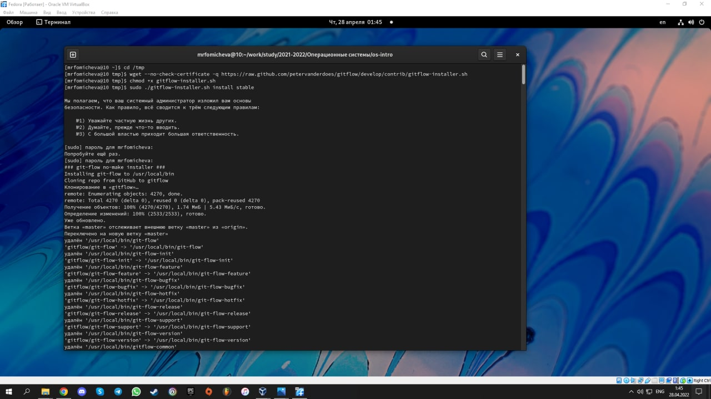
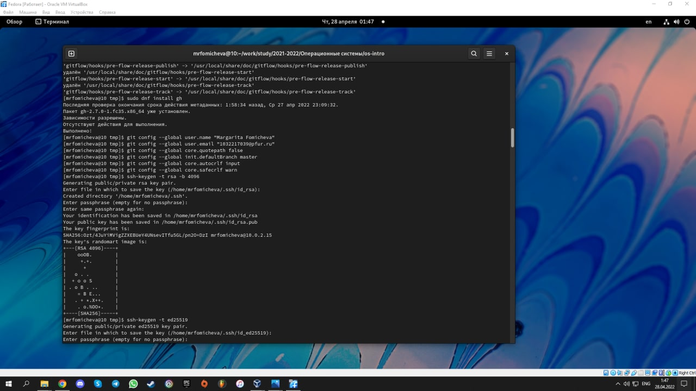
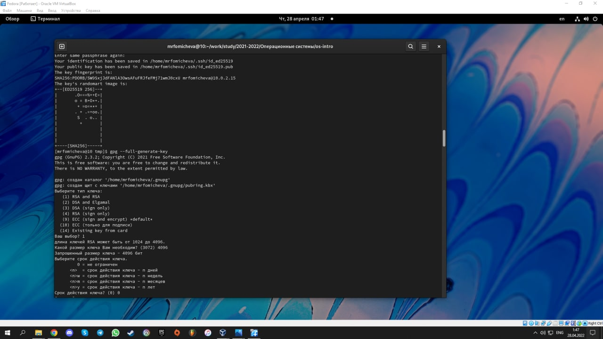
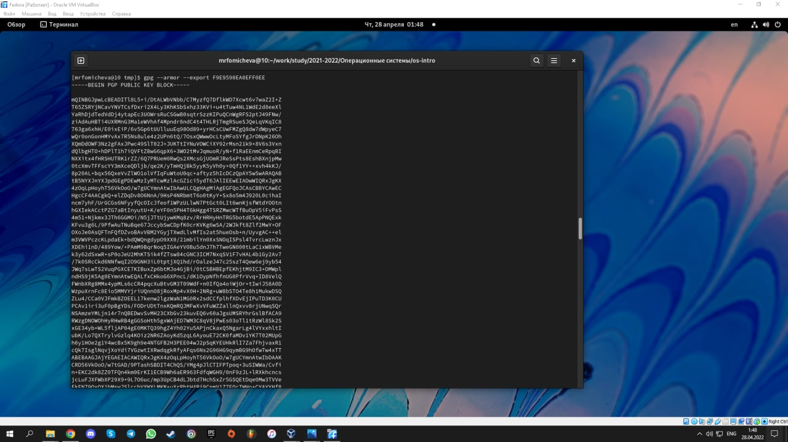
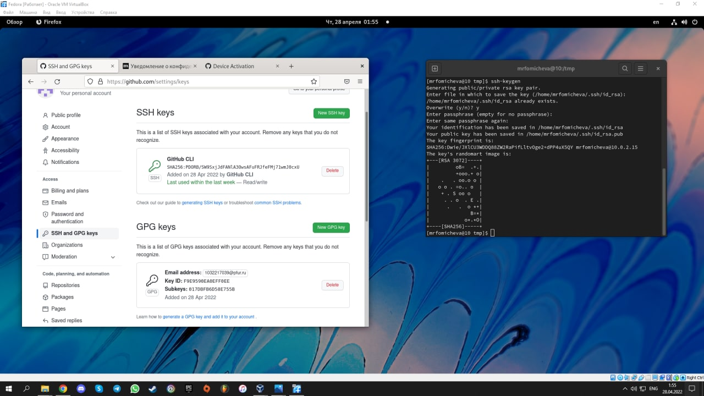
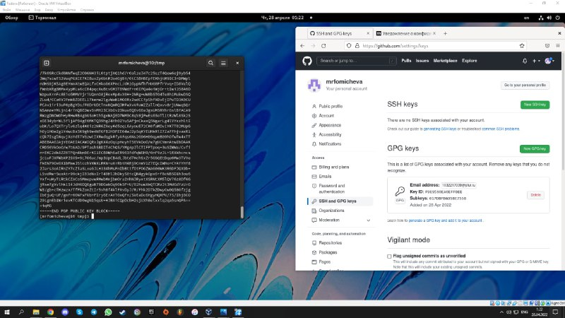
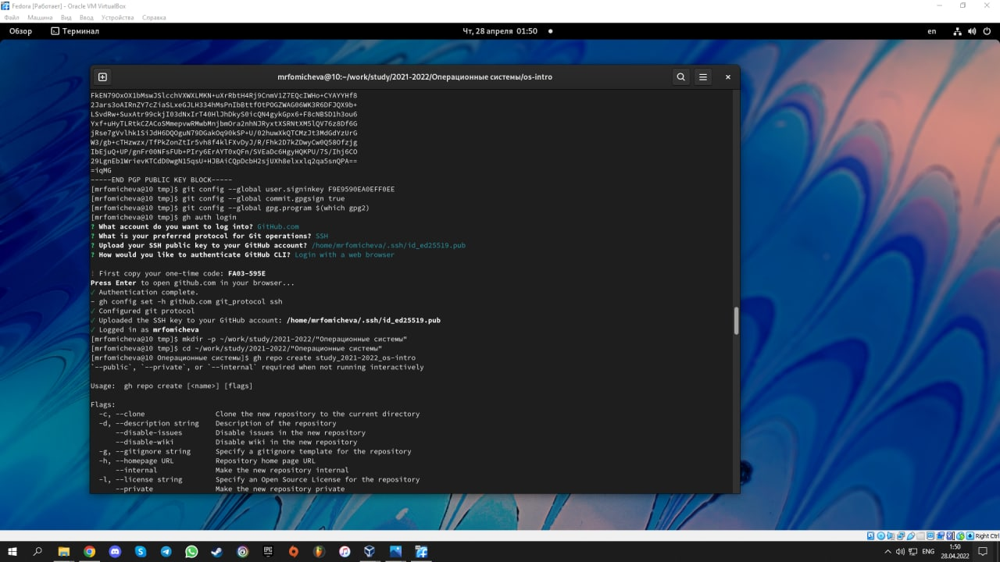
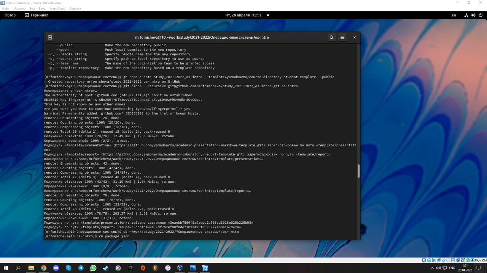

---
## Front matter
lang: ru-RU
title: "Презентация по лабораторной работе 2"
author: Фомичева Маргарита Романовна
institute: РУДН
date: 12 июня 2022

## Formatting
toc: false
slide_level: 2
theme: metropolis
header-includes: 
 - \metroset{progressbar=frametitle,sectionpage=progressbar,numbering=fraction}
 - '\makeatletter'
 - '\beamer@ignorenonframefalse'
 - '\makeatother'
aspectratio: 43
section-titles: true
---

# Цель работы

- Изучение идеологии и применение средств контроля версий, освоение умения по работе с git.

# Ход работы

- Создаю учётную запись на github и заполняю основные данные

- Устанавливаю git-flow в Fedora Linux

# Изображение 1

- Устанавливаю gh в Fedora Linux

- Осуществляю базовую настройку git

# Изображене 2

- Создаю ключи SSH и PGP

# Изображение 3

# Изображение 4

# Изображение 5

- Добавляю ключи в gh

# Изображение 6

# Изображение 7

- Настраиваю gh

# Изображение 8

# Изображение 9

# Вывод

- Я изучила идеологию и применение средств контроля версий

- Освоила умения по работе с git