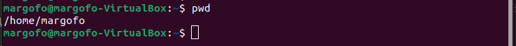
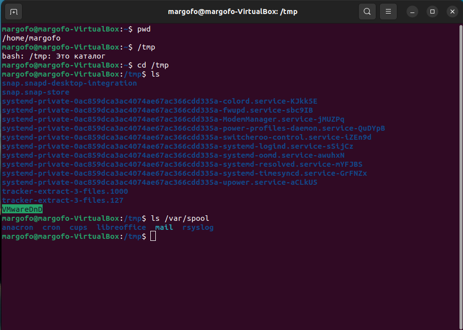
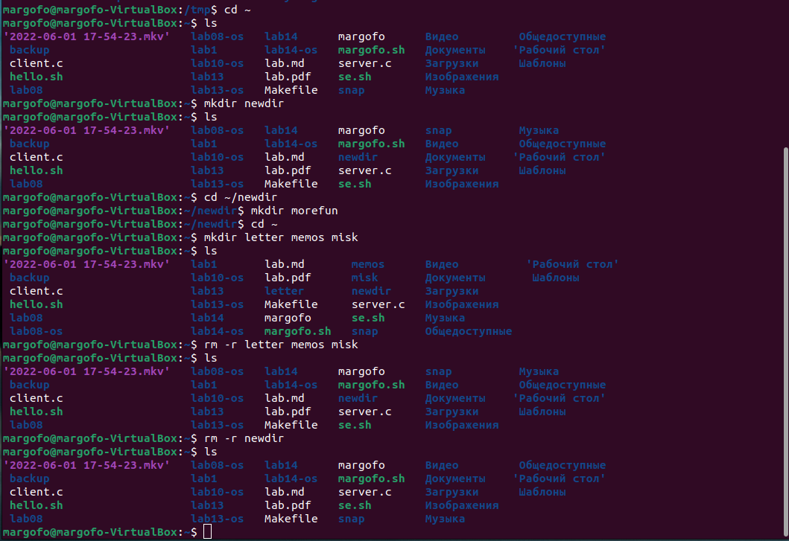
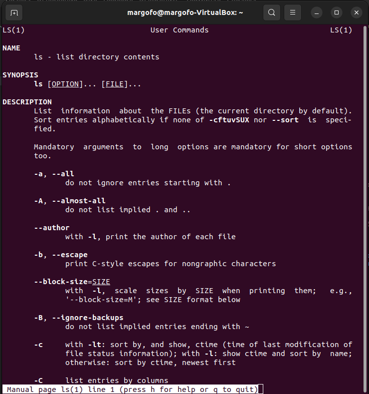
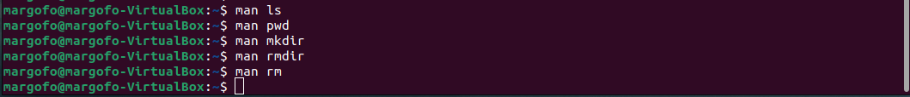
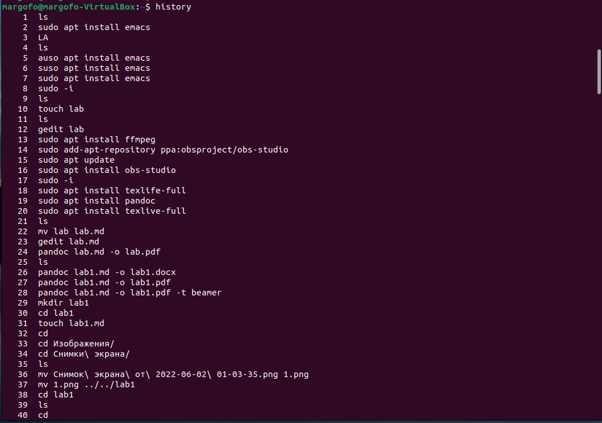

---
## Front matter
lang: ru-RU
title: "Презентация по лабораторной работе 4"
author: Фомичева Маргарита Романовна
institute: РУДН
date: 10 июня 2022

## Formatting
toc: false
slide_level: 2
theme: metropolis
header-includes: 
 - \metroset{progressbar=frametitle,sectionpage=progressbar,numbering=fraction}
 - '\makeatletter'
 - '\beamer@ignorenonframefalse'
 - '\makeatother'
aspectratio: 43
section-titles: true
---

# Цель работы

- Приобретение практических навыков взаимодействия пользователя с системой посредством командной строки

# Ход работы

### Определяю полное имя своего домашнего каталога

# Изображение 1

### Выполняю следующие действия

- Перехожу в каталог /tmp

- Вывожу на экран содержимое каталога /tmp

- Определяю, есть ли в каталоге /var/spool подкаталог с именем cron

- Перехожу в домашний каталог и вывожу на экран его содержимое 

# Изображение 2

### Выполняю следующие действия

- В домашем каталоге создаю новый каталог с именем newdir

- В каталоге ~/newdir создаю новый каталог morefun

- В домашнем каталоге создаю одной командой три новых каталога с именами letters, memos, misk. Затем удаляю эти каталоги одной командой

- Пробую удалить ранее созданный каталог ~/newdir командой rm. Проверяю, был ли каталог удалён

- Удаляю каталог ~/newdir/morefun из домашнего каталога. Проверяю, был ли каталог удалён

# Изображение 3

### С помощью команды man определила, какую опцию команды ls нужно использовать для просмотра содержимого не только указанного каталога, но и подкаталогов, входящих в него. А именно: -R, --recursive list subdirectories recursively

# Изображение 4

# Изображение 5 

### С помощью команды man определлила набор опций команды ls, позволяющий отсортировать по времени последнего изменения выводимый список содержимого каталога с развёрнутым описанием файлов. А именно: --time-style=TIME STYLE -t-T -u

# Изображение 6

# Изображение 7 

### Использую команду man для просмотра описания следующих команд: cd, pwd, mkdir, rmdir, rm. Поясняю основные опции этих команд. 

# Изображение 8

- cd - команда перемещения по файловой системе. pwd - команда, показывающая директорию, в которой находится пользователь. mkdir - команда, создающая новую директорию. rmdir - команда, удаляющая файлы или целые деревья каталогов

### Используя информацию, полученную при помощи команды history, выполняю модификацию и исполнение  нескольких команд из буфера команд

# Изображение 9

# Вывод

- Я приобрела практические навыки взаимодействия пользователя с системой посредством командной строки